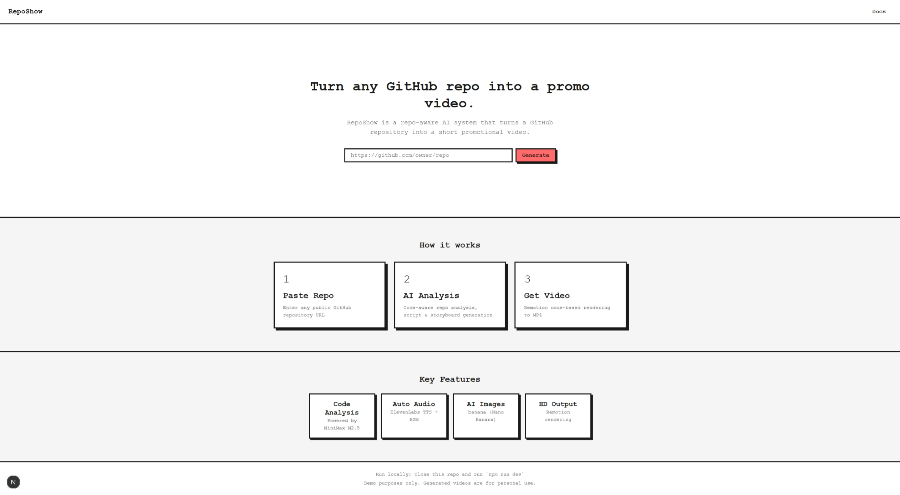
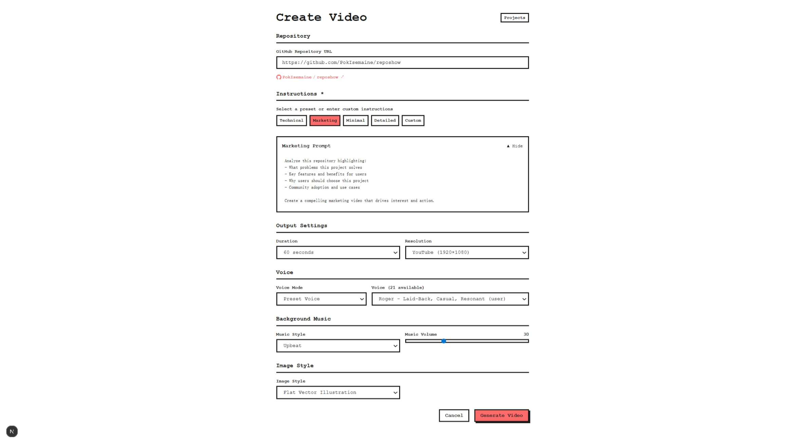
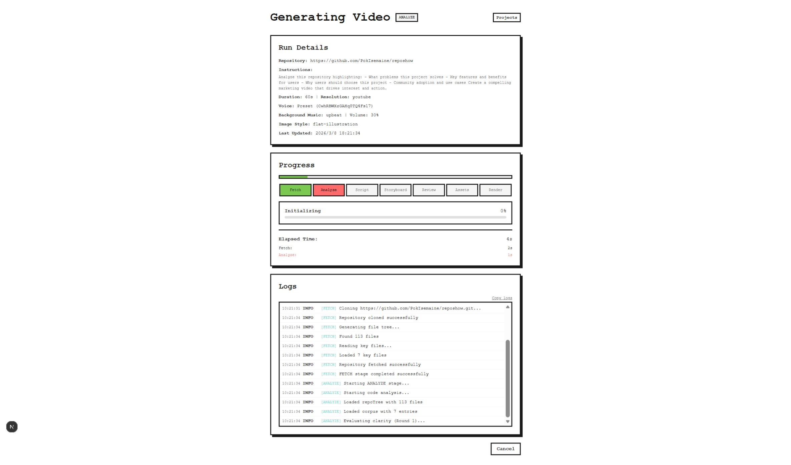
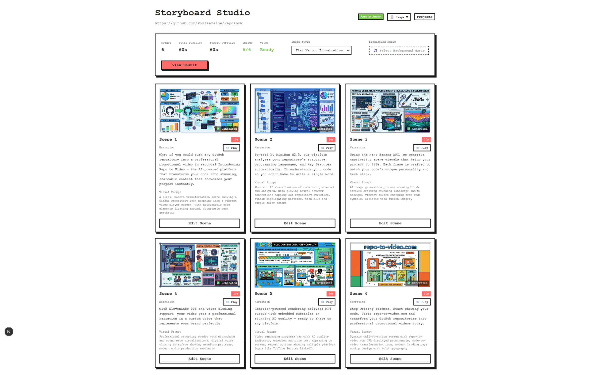
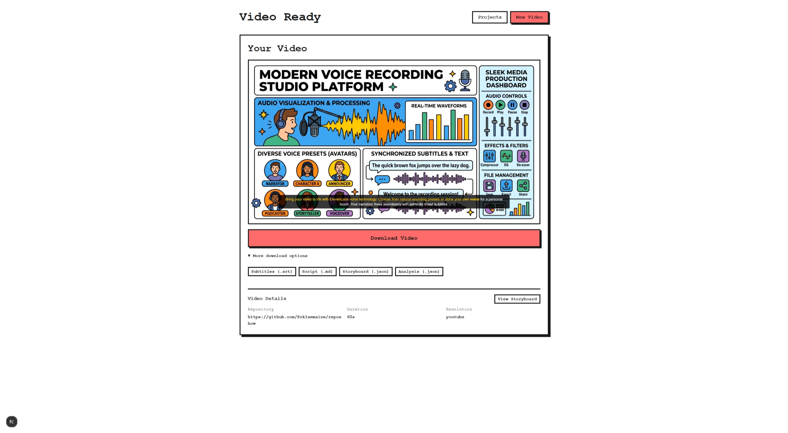

# RepoShow

<p>
  <a href="https://github.com/your-username/reposhow/actions"></a>
  <a href="https://www.apache.org/licenses/LICENSE-2.0"></a>
  <a href="https://nextjs.org"></a>
  <a href="https://github.com/your-username/reposhow/releases"></a>
</p>

Turn any GitHub repository into a professional promotional video with AI-powered code analysis and narration.

## Quick Start

```bash
# 1. Install dependencies
npm install

# 2. Copy environment template
cp .env.example .env

# 3. Configure API keys (see Configuration section)
# Edit .env with your API keys

# 4. Start development server
npm run dev
```

Open [http://localhost:3000](http://localhost:3000), paste a GitHub repo URL, and generate your video.

## Inspiration

**Great open-source projects often die in silence.**

Developers spend most of their time building, but turning a GitHub repository into a polished demo video still takes a surprising amount of manual work. You have to decide what to highlight, write a script, plan visuals, generate assets, sync narration, and edit everything into a coherent story.

At the same time, AI has made video generation much easier, but technical projects such as code repositories still present a unique challenge. A video can look polished without really reflecting what the project is about. For developer-facing products, the hard part is not just generating visuals — it is understanding the project well enough to tell a story that feels relevant and grounded.

That was the starting point for **RepoShow**.

We wanted to explore whether a GitHub repository could be turned into a short promotional video automatically — one that is visually compelling, but still connected to the project's actual purpose, flow, and value.

## Page Preview

| Landing Page | Create Config | Run Progress | Storyboard | Result |
|:---:|:---:|:---:|:---:|:---:|
|  |  |  |  |  |

## Features

- **AI-Powered Code Analysis** - MiniMax M2.5 analyzes repository structure, languages, and key features
- **Professional Script Generation** - Automatically generates engaging narration scripts
- **AI Image Generation** - Creates scene visuals using banana (Nano Banana) API
- **Voice Synthesis** - ElevenLabs TTS with voice clone support
- **Background Music** - AI-generated BGM with ElevenLabs
- **HD Video Rendering** - Remotion-powered MP4 output with subtitles

## Architecture

```
┌─────────────┐     ┌─────────────┐     ┌─────────────┐
│   Landing   │────▶│   Create    │────▶│    Run      │
│   Page      │     │   Config    │     │   Pipeline  │
└─────────────┘     └─────────────┘     └─────────────┘
                                                │
                                                ▼
                                         ┌─────────────┐
                                         │   Result    │
                                         │   Page      │
                                         └─────────────┘
```

### Pipeline Stages

| Stage | Description |
|-------|-------------|
| `FETCH` | Clone GitHub repository |
| `ANALYZE` | AI code analysis with MiniMax |
| `SCRIPT` | Generate narration script |
| `STORYBOARD` | Create scene breakdown |
| `ASSETS` | Generate images and audio |
| `RENDER` | Compose final MP4 with Remotion |

## Configuration

Create a `.env` file with the following variables:

| Variable | Required | Description |
|----------|----------|-------------|
| `MINIMAX_API_KEY` | Yes | API key for MiniMax (AI analysis/script) |
| `BANANA_API_KEY` | Yes | API key for image generation |
| `ELEVENLABS_API_KEY` | Yes | API key for TTS and BGM |
| `GITHUB_TOKEN` | No | GitHub token for private repos |
| `USE_MOCK_DATA` | No | Set `true` for development without APIs |

### Getting API Keys

- **MiniMax**: https://platform.minimax.chat
- **banana (Nano Banana)**: https://banana.sh
- **ElevenLabs**: https://elevenlabs.io

## Project Structure

```
reposhow/
├── app/                    # Next.js App Router pages
│   ├── api/               # API routes
│   ├── create/            # Configuration page
│   ├── run/               # Pipeline progress page
│   └── result/            # Video result page
├── lib/                    # Core utilities
├── prompts/                # AI prompts
├── runs/                   # Generation output (created at runtime)
└── remotion/               # Video composition config
```

## Tech Stack

- **Frontend**: Next.js 16 (App Router), React 19
- **AI**: MiniMax M2.5
- **Image**: banana (Nano Banana)
- **Audio**: ElevenLabs
- **Video**: Remotion
- **Styling**: Neo-Brutalism UI

## License

Apache License 2.0 - see [LICENSE](LICENSE) for details.

## Contributing

1. Fork the repository
2. Create a feature branch
3. Submit a Pull Request

---

Built with Next.js and Remotion
